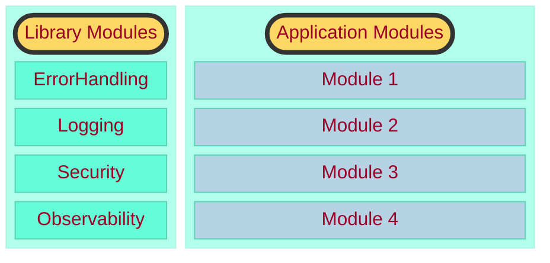

# opinionated-modular-boot
An opinionated modular-monolith structure for Spring Boot 3.0 applications.

## What does this repository cover
- Opinionated setup to structure packages within a modular spring-boot application
- Design your modular-monolith for decomposability
- How to enforce package boundaries through lightweight architecture tests

## Design Considerations
### Package Structure 

Broadly, there are two kinds of modules in the applications  
- **Library Modules**: These modules are usually cross-cutting concerns that are not domain based.
- **Application Modules**: These modules deal with the domain of the application, and they can make use of functionality available in either the library-modules or from other application modules that are available alongside.

### Dependency Rules 
1. **Library Modules** MUST NOT depend on any code in **Application Modules**
2. **Application Modules** MUST NOT have cyclic depdendencies with each other.
3. **Application Modules** CAN ONLY access other **Application Modules** through a published API (marked as such in code)
4. **Application Modules** CAN ONLY access other **Library Modules** through a published API (marked as such in code)

## Motivation 

### Design for decomposability 
In the spirit of evolutionary-architecture a package structure like the one above allows us spawn a new deployable unit (or) service by 

1) copying over the existing project over to a new location
2) removing the **Application Module(s)** that are not required in the new deployable-unit (or) service
3) keeping the **Library Module(s)** as they are
4) making suitable renames to the project (or) existing packages etc.

If the application's module boundaries are correct, splitting the modular monolith should be straightforward. Ideally, you should decouple the modules beforehand, perhaps by using application events for inter-module communication to ensure modules don't need to know about each other.

### Have just enough guard-rails
I wanted to have just enough rules to prevent the application modules from turning into a "big ball of mud." The four Dependency Rules I mentioned help us understand and verify module boundaries before making irreversible decisions, like splitting into microservices or adopting an event-driven architecture.

## Verification
### Trust, but verify 
A modular structure enforced at compile or build time is ideal, but this might require additional expertise, like using Gradle submodules. A simpler way to enforce boundaries is through testing libraries like ArchUnit. In this project, all such tests can be found in ArchitectureTests.kt.

